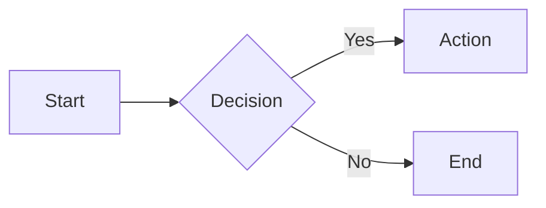

#type/cheatsheet #topic/Markdown #for/all 

Source: [Markdown Syntax](https://markdown.org)
## Inline code

```markdown
`Ctrl`
```

> [!check]- Result
> `Ctrl`

---
## HTML kbd tag

```markdown
<kbd>Ctrl</kbd> <kbd>R</kbd>
```

> [!check]- Result
> <kbd>Ctrl</kbd> <kbd>R</kbd>

---
## Colored Text

```markdown
$\color{red}{\textsf{red text}}$
```

> [!check]- Result
> $\color{red}{\textsf{red text}}$

---
## Subscript

```markdown
Water is H<sub>2</sub>O.
```

> [!check]- Result
> Water is H<sub>2</sub>O.

---
## Accordeon HTML tag

```html
<details>
<summary>Show details</summary>

Hidden text that appears
when you click the summary.

</details>
```

> [!check]- Result
> <details><summary>Show details</summary>Hidden text that appears when you click the summary.</details>

---
## Mermaid Code Syntax for a Flowchart

````markdown

````

> [!check]- Result
> ```mermaid
> flowchart LR
>   Start --> Stop
> ```

````markdown

````

> [!check]- Result
> ```mermaid
> flowchart LR
> A[Write] --> B[Preview]
> B --> C[Export]
> ```

````markdown

````

> [!check]- Result
> ```mermaid
> graph LR
>     A[Start] --> B{Decision}
>     B -->|Yes| C[Action]
>     B -->|No| D[End]
> ```

---
## Comments

```markdown
<!-- -->
```

> [!check]- Result
> \<!-- -->

---
## Math LaTeX Code Syntax

```latex
$$
a^2 + b^2 = c^2
$$
```

> [!check]- Result
> $$
> a^2 + b^2 = c^2
> $$

---
## Inline Math LaTeX Code Syntax

```latex
Inline math: $E = mc^2$
```

> [!check]- Result
> Inline math: $E = mc^2$

---
## Git Difference Code

```diff
- const old = "remove this line";
+ const updated = "add this line";
  const unchanged = "this stays";
```

---
## Basic Table

```markdown
| Header 1 | Header 2 | Header 3 |
| -------- | -------- | -------- |
| Cell 1   | Cell 2   | Cell 3   |
| Cell 4   | Cell 5   | Cell 6   |
```

> [!check]- Result
> 
> | Header 1 | Header 2 | Header 3 |
> | -------- | -------- | -------- |
> | Cell 1   | Cell 2   | Cell 3   |
> | Cell 4   | Cell 5   | Cell 6   |

---
## Advanced Table (Left-align, Center-align, Right-align)

- `:---` or `---` — left-aligned (default)
- `:---:` — center-aligned
- `---:` — right-aligned

```markdown
| Left-aligned | Center-aligned | Right-aligned |
| :----------- | :------------: | ------------: |
| Left         |     Center     |         Right |
| text         |      text      |          text |
```

> [!check]- Result
> 
> | Header 1 | Header 2 | Header 3 |
> | :-------- | :--------: | --------: |
> | Cell 1   | Cell 2   | Cell 3   |
> | Cell 4   | Cell 5   | Cell 6   |

---
## Reference Links

```markdown
Check out [this article][ref1] and [that guide][ref2].

[ref1]: https://example.com/article "Article Title"
[ref2]: https://example.com/guide "Guide Title"
```

> [!check]- Result
> You can find Markdown syntax reference in this [link][ref1] and a cheatsheet [here][ref2].
> 
> [ref1]: https://www.markdownlang.com/cheatsheet/
> [ref2]: https://www.markdowntools.io/cheat-sheet

---
## Section Links (Anchors or Internal Links)

**Markdown Syntax**
```markdown
[HTML kbd tag](00_knowledge/00_Topics/Markdown.md#HTML%20kbd%20tag)
```

> [!check]- Result
> [HTML kbd tag](00_knowledge/00_Topics/Markdown.md#HTML%20kbd%20tag)

**Wikilinks Syntax (Obsidian)**
```markdown
[[00_knowledge/00_Topics/Markdown#HTML kbd tag|HTML kbd tag]]
```

> [!check]- Result
> [[00_knowledge/00_Topics/Markdown#HTML kbd tag|HTML kbd tag]]

---
## HIghlighted Text

```html
This is <mark>highlighted text</mark> using HTML.
```

> [!check]- Result
> This is <mark>highlighted text</mark> using HTML.

```markdown
This is ==highlighted text== using HTML.
```

> [!check]- Result
> This is ==highlighted text== using HTML.

---
