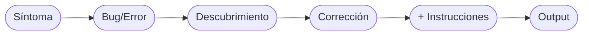
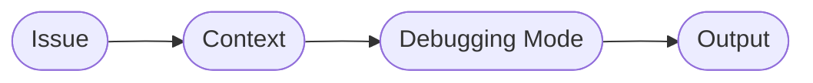

#type/Use-Case-Study #topic/Gemini-AI/Prompting-Troubleshooting #for/AI 

# Manual de Interacción con IA: Prompting y Troubleshooting

## 1. Arquitecturas de Prompts (Plantillas)

### Fase de Creación (El Inicio)
* **Rol:** Actúa como Rol específico, [ej. Administrador de Sistemas Linux Senior.]
* **Objetivo:** Escribe/Crea (Entregable).
* **Contexto:** Por qué lo necesitas y cómo se usará.
* **Formato de Salida:** Output, dile a la IA como debe estructurar su respuesta.
* **Restricciones:** Qué NO debe hacer, formato de salida, compatibilidad.

### Fase de Refinamiento (Iteración)
* **Ancla:** Sobre el [elemento específico] que acabas de generar...
* **Acción/Problema:** Necesito que [agregues/modifiques/elimines] esto.
* **Contexto/El Porqué:** El objetivo de este cambio es [razón].
* **Control de Salida:** Imprime únicamente los snippets modificados y dime en qué línea insertarlos. No devuelvas todo el código.
* **Restricciones:** Qué NO debe hacer, formato de salida, compatibilidad.

### Fase de Depuración (Debugging/Troubleshooting)
* **Síntoma/Contexto:** Al ejecutar [acción], sucede [comportamiento actual] en lugar de [comportamiento esperado].
* **El Error/Bug:** Describe qué falló. Si la terminal muestra un eror, pega textualmente: [Pegar log].
* **Descubrimiento:** Revisando el código, noté que [tu lógica o descubrimiento].
* **Acción Correctiva:** Corrige este flujo. Imprime solo el snippet corregido.
* **Nevas Instrucciones (Opcional):** En caso de contar con nuevas instrucciones, añadirlas. No es obligatorio ni necesario.
* **Output:** Para que no vuelva a escribir todo desde cero y sobre todo en programación, se le indica que imprima los cambios.

### Reporte de Falla (Failed Fix)
* **El Problema Persiste (The Issue Persist):** Apliqué los cambios, pero el problema persiste. [Describir síntoma exacto, ej. archivo de 0 bytes].
* **Contexto de Ejecución:** Estoy usando [SO, terminal, comandos exactos].
* **Petición de Rastreo (Debugging Mode / Verbose Mode):** Indícame cómo habilitar el modo de depuración (`set -x`) para ver dónde falla, o corrige el error lógico.
* **Control de Salida (Output Control):** La regla de oro siempre será limitar la respuesta, pedirle a la IA que solamente entregue los cambios con base al problema, contexto y la petición.

### Conversaciones Pausadas
Si regresas a una conversación después de unas horas o días, la IA puede perder «frescura» en el contexto. Ábrele el mensaje con un recordatorio rápido para realinearla, ej. «_Retomemos el script de tareas. En la versión actual ya configuramos la creación y el borrado. Ahora quiero que nos enfoquemos..._»

---

## 2. Glosario Técnico (Inglés a Español)
* **Context-switching:** Pérdida de foco y tiempo al cambiar entre diferentes aplicaciones o ventanas (ej. salir de la terminal para abrir una app de notas).
* **Verbose logging / Debug mode:** Modo de ejecución que imprime cada paso que da un programa antes de ejecutarlo. En Bash se activa con `set -x`.
* **Silent failure:** Cuando un programa o script falla pero no arroja ningún mensaje de error en la pantalla.
* **Payload extraction:** El proceso de descomprimir o sacar el código fuente original que está escondido dentro de un instalador.
* **Refactoring:** Reestructurar el código fuente para mejorarlo (hacerlo más limpio o eficiente) sin cambiar su comportamiento final.
* **Code snippets:** Fragmentos pequeños de código.

---

## 3. Casos de Estudio (Historial de Errores)
* **Problema:** Instalador de un solo archivo en Bash generaba un archivo vacío (0 bytes) en macOS. Era una falla silenciosa.
* **Diagnóstico:** Al activar `set -ex`, el rastreo mostró `base64: invalid argument`.
* **Causa Raíz:** Diferencias entre entornos UNIX. macOS usa utilidades BSD (que requieren la bandera `-i` en `base64`), mientras que Linux usa GNU. Además, el script constructor fallaba si el archivo fuente (payload) no estaba en el mismo directorio.

# Manual de Interacción con IA: Prompting Avanzado (Vol. 2)

## 1. Arquitecturas de Prompts (Nuevas Plantillas)

### Refinamiento con Lógica Condicional (Conditional Logic)
* **Ancla de Contexto:** Cierra el tema anterior o menciona tu conclusión.
* **El Nuevo Requerimiento:** Solicita un menú interactivo (*Interactive prompt*) para que el usuario tome una decisión.
* **La Lógica Condicional:** Define claramente las rutas (ej. Opción 1 instala global con `sudo`, Opción 2 instala local sin `sudo`).
* **Manejo de Errores/UX:** Pide a la IA que automatice la configuración (*ej. verificar el `$PATH`*) y que lo informe amigablemente al usuario.
* **Control de Salida:** Imprime solo los *snippets* modificados.

### Petición de Nueva Función (Feature Request)
* **Ancla de Estado:** Confirma el éxito del paso anterior y dirige la atención a la nueva característica.
* **La Nueva Función:** Descripción técnica (ej. Sincronización automática de Git en segundo plano).
* **Casos de Uso Esperados (Clave):** Escribe ejemplos literales de la CLI: `comando ejecutado -> comportamiento esperado`.
* **Manejo de Datos/Restricciones:** Solicita prevención de conflictos (*race conditions*) o pide recomendaciones de arquitectura (SSH vs. PAT).
* **Control de Salida:** Solo las funciones nuevas y la línea exacta donde insertarlas.

### Refactorización con Cambio de UI/CLI (UI/CLI Change)
* **Ancla de Estado:** Confirmación de cambios pasados.
* **La Función a Modificar:** Nombra la función o comando que vas a consolidar.
* **El Problema Actual:** ¿Por qué la UX actual es ineficiente? (ej. dos comandos que hacen lo mismo).
* **El Nuevo Comportamiento Esperado:** Muestra cómo el comando base usará subcomandos o banderas (ej. `syncline clear` vs `syncline clear canceled`).
* **Lógica Interna:** Pide ajustar la lectura de argumentos posicionales (como `$2`) o el uso de *flags*.
* **Control de Salida:** Snippets y actualizaciones al enrutador de comandos.

### Corrección Rápida (Micro-Debugging / Quick Fix)
* **Ancla de Estado:** Confirma que la función principal sirvió, pero encontraste algo en pruebas.
* **El Comportamiento Actual (Bug):** Describe el fallo de lógica en un caso muy específico.
* **El Comportamiento Esperado:** Cómo debe resolverse o fluir el dato.
* **Control de Salida:** Únicamente la función a corregir.

---

## 2. Glosario Técnico (Inglés a Español)
* **QA Testing (Quality Assurance):** Pruebas de uso en la vida real que el desarrollador hace para asegurarse de que las nuevas funciones no rompieron nada.
* **State Transition Bug:** Error lógico donde un elemento se queda "congelado" y el código no permite pasarlo del Estado A al Estado B.
* **Interactive Prompt / CLI Menu:** Pausa en la terminal que le pide al usuario ingresar una respuesta (como "1" o "2").
* **Argument Parsing:** La lógica que lee y procesa palabras adicionales que el usuario escribe después del comando principal.
* **One-liner (Script auxiliar):** Un bloque de código compacto ejecutado directamente en la terminal (como un bucle `while`) para editar archivos masivamente sin abrirlos.
* **Out of the box:** Un programa que funciona de inmediato y de forma transparente sin configuraciones extra.
* **Append:** Agregar texto al final de un archivo (usando `>>`) sin sobrescribir el archivo completo.
* **Overrides:** Acción de sobrescribir, anular o forzar un nuevo estado sobre uno anterior.

---

## 3. Casos de Estudio (Historial de Errores)
* **Caso:** Automatización de Git en Background (SSH vs PAT).
  * **Problema:** Miedo a que la autenticación interrumpiera la sincronización silenciosa.
  * **Descubrimiento:** SSH es transparente si no hay *passphrase*. HTTPS (PAT) funciona bien pero el proceso se traba si el *keyring* está bloqueado en el sistema operativo.
  * **Resolución:** Permitir ambas opciones de URLs en el código para que Git maneje la autenticación de forma nativa.
* **Caso:** Bloqueo de Estados (State Transition Bug).
  * **Problema:** Una tarea con estado "Check" (✓) bloqueaba la transición a estado "Cancel" (✗).
  * **Resolución:** Uso de un *Quick Fix* indicando explícitamente a la IA que los *overrides* de estado deben funcionar de manera bidireccional.

# Manual de Interacción con IA: Prompting Avanzado (Vol. 3)

## 1. Arquitecturas de Prompts (Nuevas Plantillas)

### Troubleshooting Específico de Git (Contexto de Entorno)
* **Ancla de Contexto:** Menciona qué acción de Git estabas probando.
* **El Síntoma y Rastreo:** Pega el log de error exacto (ej. `fetch first` o `refspec does not match`).
* **Contexto del Entorno (Crucial):** Detalla si usas GUI o terminal pura (*headless*), HTTPS o SSH, y el estado de tu repositorio remoto vs local.
* **Comportamiento Esperado:** Pide que el error se maneje "con gracia" (*gracefully*) o se resuelva silenciosamente en segundo plano.
* **Control de Salida:** Exige solo el *snippet* de código a reemplazar.

### Multi-Environment Bug Report (Reporte de Error Multi-Entorno)
* **Ancla de Estado:** Informa que la solución anterior causó un desajuste entre dos máquinas diferentes.
* **Síntoma 1 (Sistema A):** Describe qué falla en el primer entorno (ej. macOS reporta éxito pero no hay archivos).
* **Síntoma 2 (Sistema B):** Describe el choque en el segundo entorno (ej. Linux arroja error de *refspec*).
* **Diagnóstico Arquitectónico:** Señala la mala práctica de la IA (ej. código *hardcodeado* que rompe la compatibilidad hacia atrás).
* **El Nuevo Requerimiento:** Exige comportamiento dinámico (ej. autodetectar la rama en lugar de forzar un nombre fijo).
* **Control de Salida:** Funciones dinámicas corregidas.

---

## 2. Glosario Técnico (Inglés a Español)

* **Headless environment:** Un entorno de sistema operativo que no tiene interfaz gráfica de usuario (GUI), operado 100% por terminal (ej. servidores o contenedores).
* **Credential Helper Abstraction:** Una capa de código inteligente que detecta y usa el gestor de contraseñas nativo del sistema (`osxkeychain`, `libsecret`), en lugar de depender de uno solo.
* **Hardcoded (Código rígido):** Mala práctica de escribir valores fijos en el código (como la palabra `main` o `secret-tool`) impidiendo que el programa se adapte a otros escenarios.
* **Platform lock-in:** Estar "atrapado" o limitado a que una herramienta funcione solo en un ecosistema específico (ej. forzar herramientas de GNOME en macOS).
* **Suppressing stderr:** Ocultar los mensajes de error enviándolos a un "agujero negro" (usando `2>/dev/null`). Puede causar fallos silenciosos (*silent failures*).
* **Branch Mismatch / Disjointed branch history:** Conflicto donde el repositorio local y el remoto tienen historiales desvinculados o nombres de rama principales diferentes (`master` vs `main`).
* **Cross-environment state desynchronization:** Cuando los datos o historiales de dos máquinas (ej. tu Mac y tu Linux) pierden sincronía y entran en conflicto con el servidor central.
* **Backward compatibility:** (Compatibilidad hacia atrás) Asegurar que el código nuevo no rompa repositorios o datos viejos ya existentes.

---

## 3. Casos de Estudio (Historial de Errores)

* **Caso 1: El helper "Hardcodeado" y entornos Headless.**
  * **Problema:** Fallo al conectar con Git en macOS. El script de credenciales dependía exclusivamente de `secret-tool` (GNOME).
  * **Solución:** Arquitectura de *Credential Abstraction*. El script ahora autodetecta el SO y usa `osxkeychain` en Mac, `libsecret` en Linux, o `store` como respaldo universal.
* **Caso 2: Fallo Silencioso por Supresión de Errores.**
  * **Problema:** macOS mostraba "Sync complete" pero no descargaba notas. 
  * **Diagnóstico:** El modo *Verbose* (`set -x`) reveló que el script ocultaba el error. Estaba descargando una rama `main` vacía porque macOS inicializaba en `master`.
* **Caso 3: La trampa de forzar nombres de ramas (Main vs Master).**
  * **Problema:** La IA intentó arreglar el Caso 2 forzando el comando `git branch -M main`. Esto arregló macOS, pero rompió la máquina Linux que ya tenía un historial en `master`.
  * **Solución:** Reescribir el script para que detecte las ramas *dinámicamente*, acompañado de una migración manual estandarizada del repositorio de GitHub a `main`.

---

## 4. Snippets Útiles: Migración Manual de Master a Main

Para estandarizar un repositorio viejo y evitar desincronización entre sistemas:

**En la máquina principal:**
1. `git branch -m master main` (Renombra localmente)
2. `git push -u origin main` (Sube la nueva rama)
3. Cambiar la rama por defecto en los *Settings* de GitHub.
4. `git push origin --delete master` (Purga la rama vieja remota)

**En las máquinas secundarias (para recuperar el hilo):**
1. `git fetch origin`
2. `git branch -m master main`
3. `git branch -u origin/main main`
4. `git remote set-head origin -a`
